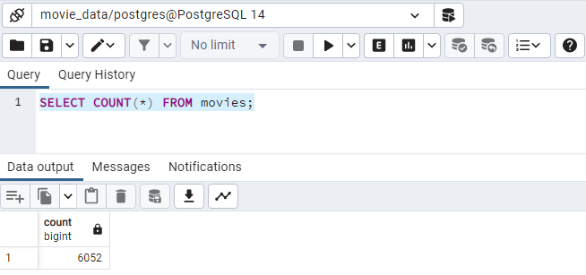
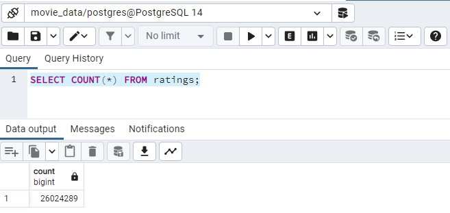

# Movies-ETL

## Overview

In this module we use the Extract, Transform, Load (ETL) process to create data pipeline for information about movies collected from Kaggle and Wikipedia.

*Python* and specifically the *Python Pandas* library were used to process the data, while *PostgreSQL* is used to store the database.

The input files are:

1. **[Wikipedia Movies File](./Resources/wikipedia-movies.json)**.
2. **[Kaggle Movies File](/Resources/movies_metadata.csv)**.
3. **[Kaggle Ratings File](https://www.kaggle.com/rounakbanik/the-movies-dataset/download)**.

## Summary

The following processess were applied to the data:

1. Read in and extract the input data.
2. Convert raw data to Pandas data frames.
3. Clean the data (i.e., edit out null values, unuseful columns, outliers, etc.).
4. Process the data (i.e. apply filters, create functions, match patterns with regular expressions, transform columns, etc.).
5. Load the processed data to a PostgreSQL database

Four deliverable *jupyter notebook* files are provided:

1. **[Deliverable 1: ETL_function_test.ipynb](./ETL_function_test.ipynb)**. Contains a test function  that reads in the three data files and creates three separate DataFrames.
2. **[Deliverable 2: ETL_clean_wiki_movies.ipynb](./ETL_clean_wiki_movies.ipynb)**. In this file, the Wikipedia movie data is extracted and conditioned to be merged with the Kaggle data.
3. **[Deliverable 3: ETL_clean_kaggle_data.ipynb](./ETL_clean_kaggle_data.ipynb)**. Here, the Kaggle movie data and the MovieLens rating data is extracted and conditioned to be merged with the Wikipedia data.
4. **[Deliverable 4:ETL_create_database.ipynb](./ETL_create_database.ipynb)**. Contain the code that process the Wikipedia movie data, the Kaggle movie data, the MovieLens ratings data, merge all of them and load the processed data to the PostgreSQL database.

## Results

Two snippet files containing the row count of the two output tables loaded in PostgreSQL are provided in the [Resources](./Resources/) folder.

*Image 01: PostgreSQL movie query.*

*Image 02: PostgreSQL ratings query.*